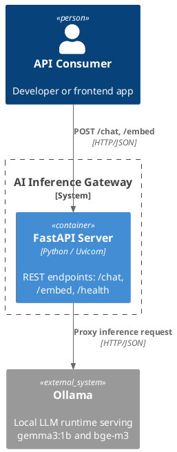

# 01 — HTTP/HTTPS: AI Inference Gateway

## What This Demonstrates

A minimal REST API gateway that sits in front of an AI model (Ollama `gemma3:1b`)
and exposes clean HTTP endpoints for chat completion and text embedding.
Falls back to mock responses when Ollama is not running.

## Architecture

```
┌────────┐   POST /chat    ┌──────────┐   /api/generate   ┌────────┐
│ Client ├────────────────►│ Gateway  ├──────────────────►│ Ollama │
│ (curl) │◄────────────────┤ (FastAPI)│◄──────────────────┤ gemma3 │
└────────┘   JSON response └──────────┘   JSON response   └────────┘
```

### PlantUML C4 Container Diagram



## Endpoints

| Method | Path      | Description                          |
|--------|-----------|--------------------------------------|
| GET    | `/health` | Liveness check + Ollama connectivity |
| POST   | `/chat`   | Send a prompt, receive a completion  |
| POST   | `/embed`  | Generate an embedding vector         |

## AI Use Case

Most AI inference — whether cloud-hosted (OpenAI, Anthropic) or self-hosted
(Ollama, vLLM, TGI) — is exposed as **HTTP REST APIs**. This is the simplest,
most widely understood pattern: the client sends a request, waits, and gets back
a complete response.

**When to use HTTP/HTTPS:**
- Request/response interactions (completions, embeddings, classification)
- Stateless inference with no long-lived connection
- Public-facing APIs that need broad client compatibility
- Batch or offline processing where latency per call is acceptable

**When NOT to use:**
- Real-time token-by-token streaming (use SSE or WebSockets)
- Internal microservice calls needing strict typing and low overhead (use gRPC)
- Long-running async jobs (use a message queue)

## Production Notes

- Add proper API key validation in the `x-api-key` header check
- Use HTTPS in production (TLS termination at a reverse proxy like Nginx/Caddy)
- Add rate limiting, request logging, and OpenTelemetry tracing
- Consider connection pooling for the Ollama backend
- Add retry logic with exponential backoff for upstream failures

## Run

```bash
# From repo root
source venv/Scripts/activate          # Windows
pip install -r 01-http-https/requirements.txt
uvicorn 01-http-https.server:app --reload --port 8001

# Test
curl http://localhost:8001/health
curl -X POST http://localhost:8001/chat \
  -H "Content-Type: application/json" \
  -d '{"message": "What is an embedding?"}'
curl -X POST http://localhost:8001/embed \
  -H "Content-Type: application/json" \
  -d '{"text": "Hello world"}'
```

Open http://localhost:8001/docs for the interactive Swagger UI.
