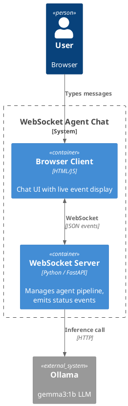

# 02 — WebSockets: Real-Time AI Agent Chat

## What This Demonstrates

A browser-based chat where each user message triggers a simulated AI agent run.
The server streams **real-time status events** back over a WebSocket so the UI
can show exactly what the agent is doing at each step.

Events emitted: `agent_started` → `tool_calling` → `tool_finished` → `final_answer`

## Architecture

```
┌─────────┐  user message   ┌──────────┐  /api/generate  ┌────────┐
│ Browser │◄───────────────►│ FastAPI  │────────────────►│ Ollama │
│  (JS)   │  agent events   │ WS Server│◄────────────────┤ gemma3 │
└─────────┘  (WebSocket)    └──────────┘                 └────────┘
```

### PlantUML C4 Container Diagram



## AI Use Case

**Agentic AI UIs** need to show users what an agent is doing in real time —
which tool it's calling, whether it's waiting on retrieval, and when the
final answer arrives. HTTP can't push; polling is wasteful. WebSockets give
a persistent, bidirectional channel that's ideal for this.

**When to use WebSockets:**
- Live agent status dashboards (tool calls, reasoning steps)
- Collaborative AI editing (multiple users + AI co-authoring)
- Interactive debugging / playground UIs
- Any use case requiring both client → server AND server → client messaging

**When NOT to use:**
- Simple one-direction streaming (use SSE — simpler)
- Stateless request/response (use HTTP)
- Communication between backend services (use gRPC or message brokers)

## Production Notes

- Implement heartbeat/ping-pong to detect stale connections
- Add authentication on WebSocket upgrade (e.g., token in query param)
- Use a connection manager for broadcast and room-based messaging
- Consider scaling with Redis pub/sub for multi-process deployments
- Always handle `WebSocketDisconnect` gracefully

## Run

```bash
source venv/Scripts/activate
pip install -r 02-websockets/requirements.txt
uvicorn 02-websockets.server:app --reload --port 8002
```

Open http://localhost:8002 in your browser and start chatting.
