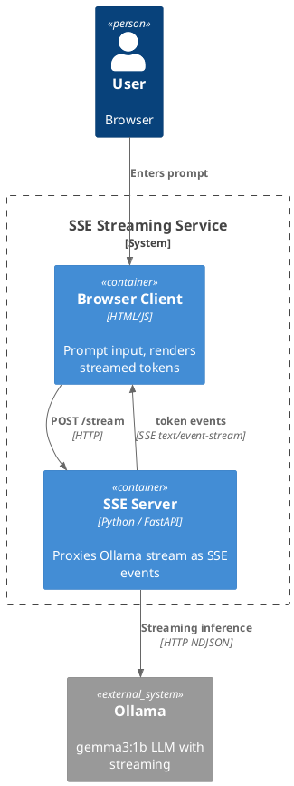

# 03 — SSE: Token Streaming AI Text Generation

## What This Demonstrates

A minimal Server-Sent Events (SSE) demo where the client sends a prompt and
the server streams generated tokens back one-by-one — exactly how ChatGPT,
Claude, and other LLM UIs deliver their "typing" effect.

## Architecture

```
┌─────────┐  POST /stream   ┌──────────┐  stream=true   ┌────────┐
│ Browser │────────────────►│ FastAPI  │───────────────►│ Ollama │
│  (JS)   │◄════════════════│ SSE      │◄═══════════════│ gemma3 │
└─────────┘  token events   └──────────┘  NDJSON chunks └────────┘
             (text/event-stream)
```

### PlantUML C4 Container Diagram



## AI Use Case

Every major LLM provider uses SSE (or a close variant) for streaming
completions. SSE is the right choice when:

- The server needs to push a **stream of events** to the client
- The client does **not** need to send messages mid-stream
- You want the simplicity of plain HTTP (no protocol upgrade)

**When to use SSE:**
- LLM token streaming (the canonical use case)
- Progress updates for long-running AI jobs
- Live log tailing from AI pipelines
- Any server→client-only push over HTTP

**When NOT to use:**
- Bidirectional communication (use WebSockets)
- Binary data streaming (SSE is text-based)
- Internal service-to-service calls (use gRPC)

## SSE vs WebSockets for AI Streaming

| Aspect        | SSE                       | WebSocket                    |
|---------------|---------------------------|------------------------------|
| Direction     | Server → Client only      | Bidirectional                |
| Transport     | Plain HTTP                | Upgraded connection          |
| Reconnect     | Built-in auto-reconnect   | Must implement manually      |
| Complexity    | Very simple               | More complex                 |
| Best for      | Token streaming, logs     | Agent UIs, collaborative apps|

## Production Notes

- SSE connections hold an HTTP connection open — use async servers (uvicorn)
- Add `Last-Event-ID` support for resumable streams
- Set appropriate timeouts on load balancers (they may kill idle SSE connections)
- Consider using `Transfer-Encoding: chunked` for compatibility

## Run

```bash
source venv/Scripts/activate
pip install -r 03-sse/requirements.txt
uvicorn 03-sse.server:app --reload --port 8003
```

Open http://localhost:8003 and click **Generate**.
