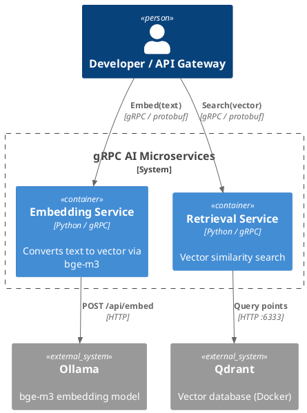

# 04 — gRPC: Internal AI Microservices

## What This Demonstrates

Two gRPC microservices that mirror a typical RAG backend:

1. **Embedding Service** (port 50051) — wraps Ollama's `bge-m3` model
2. **Retrieval Service** (port 50052) — searches a Qdrant vector database

A gateway client calls them in sequence: **embed → search** — the core
of every retrieval-augmented generation pipeline.

## Architecture

```
                          gRPC :50051
┌────────┐  embed(text) ┌────────────┐  HTTP      ┌────────┐
│ Client ├─────────────►│ Embedding  ├───────────►│ Ollama │
│        │              │ Service    │            │ bge-m3 │
│        │  search(vec) ├────────────┤            └────────┘
│        ├─────────────►│ Retrieval  ├───────────►┌────────┐
│        │              │ Service    │  HTTP :6333│ Qdrant │
└────────┘  gRPC :50052 └────────────┘            └────────┘
```

### PlantUML C4 Container Diagram



## AI Use Case

In production AI systems, internal services communicate over **gRPC** rather
than REST because:

- **Protocol Buffers** enforce strict typing — no ambiguous JSON schemas
- **HTTP/2** enables multiplexing, header compression, and streaming RPCs
- **Code generation** produces typed client/server stubs automatically
- **Lower latency** than JSON-over-HTTP for high-throughput internal calls

**When to use gRPC:**
- Internal microservice communication (embedding ↔ retrieval ↔ reranking)
- High-throughput model serving (TensorFlow Serving, Triton use gRPC)
- Polyglot environments (protobuf compiles to Python, Go, Java, Rust, etc.)
- Streaming RPCs (server-streaming, bidirectional)

**When NOT to use:**
- Public-facing APIs consumed by browsers (use REST or SSE)
- Simple prototypes where JSON/REST is faster to develop
- When firewall/proxy infrastructure doesn't support HTTP/2

## Production Notes

- Use TLS for inter-service gRPC in production
- Add gRPC interceptors for logging, auth, and tracing
- Consider gRPC-Web or Envoy for browser clients
- Use connection pooling and keepalive for high-throughput
- Health-check services via the gRPC Health Checking Protocol

## Run

```bash
source venv/Scripts/activate
pip install -r 04-grpc/requirements.txt

# Start Qdrant (Docker)
cd 04-grpc && docker compose up -d && cd ..

# Generate protobuf stubs
cd 04-grpc && python generate_proto.py && cd ..

# Terminal 1 — Embedding service
cd 04-grpc && python embedding_server.py

# Terminal 2 — Retrieval service
cd 04-grpc && python retrieval_server.py

# Terminal 3 — Client
cd 04-grpc && python client.py "What is vector search?"
```
