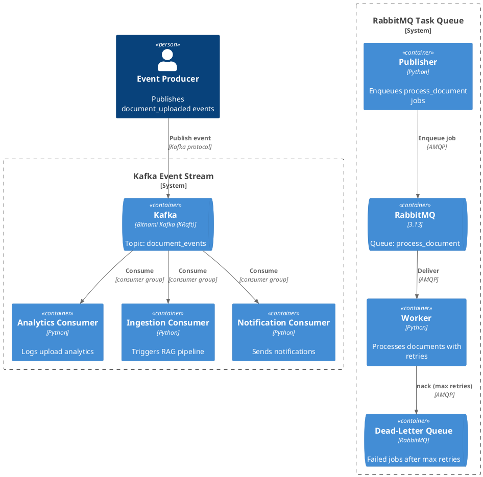

# 05 — Message Brokers: Kafka Event Stream + RabbitMQ Task Queue

## What This Demonstrates

Two complementary messaging patterns used in AI backend systems:

| Subfolder             | Pattern         | Use Case                         |
|-----------------------|-----------------|----------------------------------|
| `kafka-event-stream/` | Pub/Sub events  | Fan-out to multiple consumers    |
| `rabbitmq-task-queue/`| Work queue      | Reliable job processing with DLQ |

## Architecture

### Kafka — Event-Driven Fan-Out

```
                         ┌──────────────────┐
                    ┌───►│ Analytics Logger  │
┌──────────┐       │    └──────────────────┘
│ Producer ├──►[Kafka]──►┌──────────────────┐
│ (upload) │       │    │ Ingestion Trigger │
└──────────┘       │    └──────────────────┘
                   └───►┌──────────────────┐
                        │ Notification Log │
                        └──────────────────┘
```

### RabbitMQ — Work Queue with Dead-Letter

```
┌───────────┐     ┌──────────┐     ┌────────┐
│ Publisher  ├────►│ RabbitMQ ├────►│ Worker │
│ (enqueue) │     │  Queue   │     │        │
└───────────┘     └────┬─────┘     └───┬────┘
                       │  nack after    │
                       │  max retries   │
                  ┌────▼─────┐         │
                  │   DLQ    │◄────────┘
                  └──────────┘
```

### PlantUML C4 Container Diagram



## Broker vs Queue — Key Distinction

| Aspect         | Broker (Kafka)                    | Queue (RabbitMQ)                 |
|----------------|-----------------------------------|----------------------------------|
| Pattern        | Pub/Sub — events fan out          | Work queue — one consumer per msg|
| Retention      | Retains events on disk (replay)   | Deletes after ack                |
| Consumers      | Multiple independent groups       | Competing consumers              |
| Ordering       | Per-partition ordering             | FIFO per queue                   |
| Best for       | Event sourcing, audit logs, fan-out| Job processing, task dispatch    |

## AI Use Cases

- **Kafka**: RAG ingestion pipeline triggers, model evaluation event streams,
  multi-tenant analytics, audit logging for compliance
- **RabbitMQ**: Document processing jobs, batch embedding generation,
  async model inference queues, retry-heavy operations

**When to use a message broker:**
- Decoupling producers from consumers
- Multiple independent reactions to the same event
- Event replay and audit trail requirements
- High-throughput event streaming

**When to use a task queue:**
- Exactly-once job processing with acknowledgement
- Retry and dead-letter handling for unreliable operations
- Load leveling — absorb traffic spikes, process at worker pace
- Background job processing (PDF parsing, video transcription)

**When NOT to use either:**
- Synchronous request/response (use HTTP or gRPC)
- Real-time UI updates (use WebSockets or SSE)
- Simple sequential workflows (use an orchestrator)

## Production Notes

- Kafka: configure retention policies, partition counts, and consumer lag monitoring
- RabbitMQ: set up DLQ alerting, connection pooling, and queue TTLs
- Both: use schema registries (Avro/Protobuf) for message contracts
- Monitor consumer lag (Kafka) and queue depth (RabbitMQ)

## Run

### Kafka

```bash
# Start Kafka
cd 05-message-brokers/kafka-event-stream && docker compose up -d && cd ../..

source venv/Scripts/activate
pip install -r 05-message-brokers/kafka-event-stream/requirements.txt

# Terminal 1 — Analytics consumer
python 05-message-brokers/kafka-event-stream/consumer_analytics.py

# Terminal 2 — Ingestion consumer
python 05-message-brokers/kafka-event-stream/consumer_ingestion.py

# Terminal 3 — Notification consumer
python 05-message-brokers/kafka-event-stream/consumer_notification.py

# Terminal 4 — Publish events
python 05-message-brokers/kafka-event-stream/producer.py
```

### RabbitMQ

```bash
# Start RabbitMQ
cd 05-message-brokers/rabbitmq-task-queue && docker compose up -d && cd ../..

pip install -r 05-message-brokers/rabbitmq-task-queue/requirements.txt

# Terminal 1 — Worker
python 05-message-brokers/rabbitmq-task-queue/worker.py

# Terminal 2 — Publish jobs
python 05-message-brokers/rabbitmq-task-queue/publisher.py
```

RabbitMQ Management UI: http://localhost:15672 (guest/guest)
