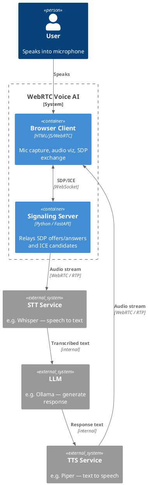

# 06 — WebRTC: Voice AI Prototype

## What This Demonstrates

A minimal WebRTC signaling skeleton with real browser microphone capture.
Shows how the signaling flow works and how it connects to a voice AI pipeline
(STT → LLM → TTS).

The demo captures actual microphone audio with frequency visualization,
and implements the WebRTC signaling exchange (offer/answer/ICE) over
WebSocket — the foundation of any real-time voice AI system.

## Architecture

### Full Voice AI Pipeline (production target)

```
┌──────────┐  audio   ┌───────────┐  text  ┌─────┐  text  ┌─────┐  audio  ┌──────────┐
│ Browser  ├─────────►│   STT     ├───────►│ LLM ├───────►│ TTS ├────────►│ Browser  │
│ (mic)    │  WebRTC  │ (Whisper) │        │     │        │     │  WebRTC │ (speaker)│
└──────────┘          └───────────┘        └─────┘        └─────┘         └──────────┘
      ▲                                                                        │
      └────────────────── Signaling Server (WebSocket) ────────────────────────┘
```

### This Demo (signaling skeleton)

```
┌──────────┐  WebSocket   ┌───────────────┐
│ Browser  │◄────────────►│ Signaling     │
│ (mic +   │  SDP/ICE     │ Server        │
│  viz)    │              │ (FastAPI)     │
└──────────┘              └───────────────┘
```

### PlantUML C4 Container Diagram



## AI Use Case

Voice AI assistants (think: phone agents, smart speakers, voice copilots)
need **sub-200ms round-trip latency** for natural conversation. WebRTC
provides this through:

- **Direct peer-to-peer media** (or via a low-latency SFU)
- **Opus codec** with adaptive bitrate, ideal for speech
- **ICE/STUN/TURN** for NAT traversal
- **Built-in echo cancellation** and noise suppression in browsers

**When to use WebRTC:**
- Real-time voice AI assistants and phone bots
- Live interview / tutoring AI systems
- Multimodal AI (voice + video + screen share)
- Any scenario requiring <200ms audio latency

**When NOT to use:**
- Text-only AI interactions (use HTTP/WebSocket)
- Batch audio processing (just upload the file)
- Non-interactive audio (use SSE for TTS streaming)

## How WebRTC Signaling Works

1. **Offer**: Browser creates an SDP offer describing its media capabilities
2. **Answer**: Server (or remote peer) responds with an SDP answer
3. **ICE Candidates**: Both sides exchange network candidates for connectivity
4. **Media Flow**: Once ICE succeeds, audio/video flows directly (peer-to-peer or via SFU)

The signaling channel (WebSocket in this demo) is only for negotiation —
actual media never flows through it.

## Production Notes

- Deploy a TURN server (e.g., coturn) for reliable NAT traversal
- Use an SFU (e.g., Janus, LiveKit) for server-side media processing
- Stream audio to Whisper / Deepgram for STT
- Pipe text through LLM with streaming for low latency
- Use streaming TTS (Piper, ElevenLabs) and send audio back via RTP
- Consider VAD (Voice Activity Detection) for turn-taking

## Run

```bash
source venv/Scripts/activate
pip install -r 06-webrtc-voice-ai/requirements.txt
uvicorn 06-webrtc-voice-ai.server:app --reload --port 8006
```

Open http://localhost:8006 — click **Start Mic** to capture audio and see
the frequency visualizer. Use the signaling buttons to simulate the
WebRTC negotiation flow.
