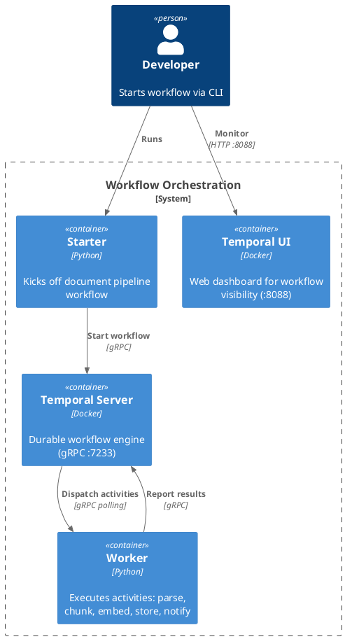

# 07 — Workflow Orchestration: Temporal Document Pipeline

## What This Demonstrates

A **Temporal**-based workflow that models a document ingestion pipeline
with five sequential steps:

```
upload → parse → chunk → embed → store → notify
```

Each step is a Temporal **activity** with its own retry policy and timeout.
Temporal provides durable execution — if a worker crashes mid-pipeline,
it resumes from the last completed step, not from the beginning.

## Architecture

```
┌─────────┐  start workflow  ┌──────────┐  poll tasks  ┌────────┐
│ Starter ├─────────────────►│ Temporal ├─────────────►│ Worker │
│ (CLI)   │                  │ Server   │◄─────────────┤        │
└─────────┘                  └────┬─────┘  report done │ parse  │
                                  │                    │ chunk  │
                             ┌────▼─────┐             │ embed  │
                             │ Temporal │             │ store  │
                             │ UI :8088 │             │ notify │
                             └──────────┘             └────────┘
```

### PlantUML C4 Container Diagram



## Orchestrator vs Broker vs Queue

| Aspect       | Orchestrator (Temporal)        | Broker (Kafka)                | Queue (RabbitMQ)             |
|--------------|--------------------------------|-------------------------------|------------------------------|
| Pattern      | Stateful multi-step workflows  | Event fan-out                 | Job dispatch                 |
| State        | Full workflow state & history  | Log of events                 | Message in queue until ack   |
| Retries      | Per-step, configurable policies| Consumer-side                 | Requeue / DLQ               |
| Ordering     | Explicit step sequencing       | Per-partition                 | FIFO per queue               |
| Visibility   | Built-in UI, query, signals   | Consumer lag monitoring       | Queue depth monitoring       |
| Best for     | Multi-step pipelines           | Event distribution            | Single-step job processing   |

## AI Use Case

AI pipelines are inherently multi-step and failure-prone:

- Document ingestion: parse → chunk → embed → store
- Model training: fetch data → preprocess → train → evaluate → deploy
- RAG pipelines: query → retrieve → rerank → generate → validate

An orchestrator manages the **control flow** — it knows which step is next,
which failed, and how to retry. Brokers and queues only move messages;
they don't understand the pipeline.

**When to use an orchestrator:**
- Multi-step AI pipelines with dependencies between steps
- Long-running workflows that must survive failures
- When you need visibility into step-level status
- Complex retry, timeout, and compensation logic

**When NOT to use:**
- Simple single-step async jobs (use a queue)
- Event fan-out to independent consumers (use a broker)
- Real-time streaming (use SSE or WebSocket)

## Production Notes

- Use Temporal Cloud or a production Temporal cluster (not the dev server)
- Set appropriate timeouts per activity based on expected duration
- Use Temporal's retry policies instead of implementing retry in activities
- Leverage workflow signals and queries for real-time status
- Add activity heartbeats for long-running steps (e.g., large document parsing)
- Use the Temporal UI for debugging failed workflows

## Run

### Option A: With Temporal (Docker)

```bash
# Start Temporal server + UI
cd 07-workflow-orchestration && docker compose up -d && cd ..

source venv/Scripts/activate
pip install -r 07-workflow-orchestration/requirements.txt

# Terminal 1 — Worker
cd 07-workflow-orchestration && python worker.py

# Terminal 2 — Start a pipeline
cd 07-workflow-orchestration && python starter.py
```

Open http://localhost:8088 to see the workflow in the Temporal UI.

### Option B: Without Docker (Temporal CLI)

```bash
# Install Temporal CLI: https://docs.temporal.io/cli
temporal server start-dev

# Then run worker and starter as above
```
