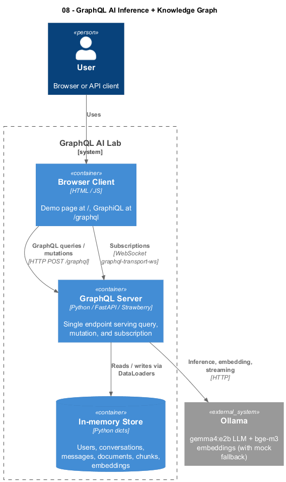

# 08 — GraphQL: AI Inference + Knowledge Graph

## What This Demonstrates

A single GraphQL endpoint that exposes an AI conversation history, a small
RAG-style document corpus, and live token streaming over subscriptions —
designed as a **wide reference** for every core GraphQL feature you're
likely to hit in production. Backed by Ollama (`gemma4:e2b` for chat,
`bge-m3:latest` for embeddings) with a mock fallback so it always runs.

This demo deliberately covers more surface than 01–07: it's optimised for
learning by practising and for future copy-paste recall.

## Architecture

```
┌─────────┐  HTTP POST       ┌────────────────┐   /api/generate    ┌────────┐
│ Browser │─────────────────►│ FastAPI +      │───────────────────►│ Ollama │
│  (JS /  │  WebSocket sub   │ Strawberry     │   /api/embed       │ gemma4 │
│ GraphiQL)│◄════════════════│ /graphql       │◄───────────────────┤ bge-m3 │
└─────────┘                  └────────────────┘                    └────────┘
                                  ▲
                                  │ DataLoaders (per-request)
                                  ▼
                             In-memory store
                       (users, conversations, docs)
```

### PlantUML C4 Container Diagram



Source: [`architecture.puml`](architecture.puml). Re-render after edits with:

```bash
plantuml -tpng architecture.puml
```

## Schema Overview

```graphql
type Query {
  health: HealthStatus!
  models: [Model!]!                                # interface
  conversation(id: ID!): Conversation
  conversations(limit: Int = 10, offset: Int = 0): [Conversation!]!
  documents(first: Int = 5, after: String): DocumentConnection!  # Relay
  search(query: String!, limit: Int = 5): [SearchResult!]!       # union
}

type Mutation {
  createConversation(title: String!, userId: ID = "u1"): Conversation!
  sendMessage(input: SendMessageInput!): ChatPayload!            # union outcome
  embedText(text: String!): Embedding!
  uploadDocument(input: UploadDocumentInput!): Document!
}

type Subscription {
  tokenStream(conversationId: ID!, message: String!): TokenEvent!
  ingestionStatus(documentId: ID!): IngestionEvent!
}
```

See [`sample_queries.graphql`](sample_queries.graphql) for runnable examples
of every operation.

## AI Use Case

GraphQL is widely used to expose **structured AI metadata** — model
catalogs, conversation history, agent tool inventories, document graphs,
permission-scoped views — through a single typed endpoint where each
client picks exactly the fields it needs. Subscriptions add a typed
streaming channel for token-by-token output, ingestion progress, or live
agent state.

**When to use GraphQL:**
- Multiple frontends (web, mobile, IDE) that need different field shapes
  from the same backend
- Schemas that evolve quickly: `@deprecated` lets you retire fields
  without breaking old clients
- Heavily nested data (conversations → messages → models) where REST
  would force N+1 round-trips
- Workflows that benefit from a single typed contract over query,
  mutation, *and* streaming

**When NOT to use:**
- Token-streaming-only LLM endpoints — SSE (#03) is simpler
- Internal service-to-service calls — gRPC (#04) is faster and stricter
- Public APIs needing aggressive HTTP caching — REST (#01) is friendlier
  to CDNs and proxies

## GraphQL vs REST / SSE / WebSocket

| Aspect          | GraphQL                 | REST (#01)        | SSE (#03)             | WebSocket (#02)       |
|-----------------|-------------------------|-------------------|-----------------------|-----------------------|
| Endpoints       | One (`/graphql`)        | Many              | One per stream        | One per connection    |
| Schema          | Strongly typed (SDL)    | Convention / OpenAPI | Untyped events     | Untyped events        |
| Field selection | Client-shaped           | Server-fixed      | n/a                   | n/a                   |
| Streaming       | Yes (subscriptions)     | No (or chunked)   | Yes                   | Yes                   |
| HTTP caching    | Hard (POST + variables) | Easy              | Medium                | n/a                   |
| Tooling         | GraphiQL, Apollo, Relay | curl, OpenAPI     | EventSource           | Manual                |

## Feature Coverage

This demo intentionally exercises every core GraphQL capability — pick a
row, jump to the file, copy the pattern.

| Feature                          | Where to look                                                                |
|----------------------------------|------------------------------------------------------------------------------|
| Query / Mutation / Subscription  | `resolvers.py` — three root types                                            |
| Object types                     | `schema.py` — `User`, `Conversation`, `Message`, `Document`, `Chunk`, ...    |
| **Interface** + implementations  | `schema.py` — `Model` → `ChatModel`, `EmbeddingModel`                        |
| **Union** types                  | `schema.py` — `SearchResult`, `ChatPayload`                                  |
| Enums                            | `schema.py` — `MessageRole`, `IngestionStatus`                               |
| Input types                      | `schema.py` — `SendMessageInput`, `UploadDocumentInput`                      |
| Custom scalars                   | `Embedding.metadata` uses Strawberry's JSON scalar; `createdAt` is DateTime  |
| Lists & non-null modifiers       | Throughout — see schema introspection                                        |
| **Nested resolvers**             | `Conversation.messages → Message.model → ChatModel` chain                    |
| Field arguments + defaults       | `Conversation.messages(limit, after)`, `Query.documents(first, after)`       |
| **DataLoader** (N+1 prevention)  | `resolvers.py` — `make_loaders()` per-request bundle                         |
| **Errors as data**               | `Mutation.sendMessage` returns `ChatPayload` union                           |
| `@deprecated`                    | `Conversation.summary` field                                                 |
| Relay-style pagination           | `Query.documents` returns `DocumentConnection` with edges/cursor/pageInfo    |
| Offset-based pagination          | `Query.conversations(limit, offset)`                                         |
| **Subscriptions** (WS)           | `Subscription.tokenStream`, `Subscription.ingestionStatus`                   |
| Context (request-scoped)         | `server.py` — `get_context()` returns DataLoaders                            |
| **Aliases**                      | `sample_queries.graphql` — `PaginatedDocs` query                             |
| Inline & named **fragments**     | `sample_queries.graphql` — `DocCore` fragment                                |
| **Variables**                    | `sample_queries.graphql` — `WithDirectives`, `Stream`                        |
| `@include` / `@skip` directives  | `sample_queries.graphql` — `WithDirectives`                                  |
| Introspection                    | `sample_queries.graphql` — `Introspect` query                                |

## Production Notes

- **DataLoader correctness**: must be created per-request, not globally —
  otherwise loaders cache across users (data leak) or never reset. The
  `context_getter` pattern in `server.py` does this right.
- **Query depth / complexity limits**: a single GraphQL query can request
  arbitrary nesting. In production, add depth limits (e.g.
  `strawberry.extensions.QueryDepthLimiter`) and per-field cost analysis
  to prevent DoS via expensive nested queries.
- **Authentication**: read auth headers in `get_context()` and pass to
  resolvers via `info.context`. Don't put auth checks on every resolver —
  use a field extension or a directive.
- **Persisted queries / APQ**: clients send a hash; server looks up the
  registered query. Reduces payload size and lets you allowlist queries
  in production.
- **Subscriptions over SSE**: GraphQL also has an SSE subscription
  protocol (`graphql-sse`) — useful when WebSockets are blocked by
  corporate proxies. Strawberry supports both.
- **Caching**: GraphQL POSTs aren't HTTP-cacheable by default; either
  use GET with persisted queries, or cache at the field/resolver level
  (e.g. Redis-backed DataLoader).
- **N+1 across services**: when a resolver calls another service, batch
  with DataLoader on a request key, not at the network call level.

## Run

### Option A — Docker (recommended; matches what was tested)

```bash
cd 08-graphql
docker compose up --build              # build image + run in foreground
docker compose up -d --build           # same, but detached (returns prompt)
```

Then open:
- http://localhost:8008/         — built-in HTML demo (query + WS sub)
- http://localhost:8008/graphql  — GraphiQL UI
- http://localhost:8008/health   — plain liveness check

#### Lifecycle commands (do **not** delete the container, image, or volumes)

```bash
docker compose ps                      # show service status
docker compose logs -f                 # tail container logs (Ctrl+C to detach)
docker compose stop                    # stop the container, keep it on disk
docker compose start                   # start a previously-stopped container
docker compose restart                 # stop + start in one step
docker compose pause                   # freeze processes (SIGSTOP, no exit)
docker compose unpause                 # resume after pause
docker compose exec graphql sh         # open a shell inside the container
```

`stop` is the safest "I'm done for now" command — the container, image,
network, and any mounted state are preserved, and `start` brings it back
without rebuilding.

#### Cleanup commands (these **do** remove things — use intentionally)

```bash
docker compose down                    # stop + remove container & network (image + volumes kept)
docker compose down --volumes          # also delete named volumes (this demo has none)
docker compose down --rmi local        # also delete the locally built image
```

### Option B — Local Python

```bash
# From repo root
source venv/Scripts/activate                       # Windows
pip install -r 08-graphql/requirements.txt
cd 08-graphql                                      # required: multi-file imports
uvicorn server:app --reload --port 8008
```

## Walkthrough — see how the app actually works

Once it's running on port 8008, follow these five steps in order. Each
exercises a different layer of the demo.

### 1. Sanity check — is Ollama reachable?

```bash
curl -s http://localhost:8008/graphql \
  -H "Content-Type: application/json" \
  -d '{"query":"{ health { status ollamaConnected chatModel embedModel } }"}'
```

Expected:
```json
{"data":{"health":{"status":"ok","ollamaConnected":true,"chatModel":"gemma4:e2b","embedModel":"bge-m3:latest"}}}
```

`ollamaConnected:false` is fine too — the demo falls back to mock
responses without changing the API contract.

### 2. Nested query — show DataLoader doing its job

```bash
curl -s http://localhost:8008/graphql \
  -H "Content-Type: application/json" \
  -d '{"query":"{ conversations(limit: 3) { id title user { name } messages(limit: 5) { role content model { name } } } }"}'
```

Three conversations, each with its `user` and `messages`, each message
with its `model`. Without DataLoaders this would issue 3 + 3 + N+M
back-end calls; with batching it's a constant number per type.

### 3. Mutation that calls the LLM (real Ollama round-trip)

```bash
curl -s http://localhost:8008/graphql \
  -H "Content-Type: application/json" \
  -d '{"query":"mutation { sendMessage(input: { conversationId: \"c1\", content: \"Say hi in five words.\" }) { __typename ... on ChatSuccess { message { content tokensUsed } } } }"}'
```

The reply is generated by `gemma4:e2b` and stored in the in-memory
conversation, which you can re-query with step 2.

### 4. Errors-as-data — typed failure branches

The same mutation can return three concrete types. Trigger the
`RateLimitError` branch with the magic word:

```bash
curl -s http://localhost:8008/graphql \
  -H "Content-Type: application/json" \
  -d '{"query":"mutation { sendMessage(input: { conversationId: \"c1\", content: \"rate-limit\" }) { __typename ... on RateLimitError { retryAfterSeconds errorMessage } } }"}'
```

This is the GraphQL pattern for *expected* failures — they're part of
the schema, not HTTP 4xx codes. Top-level `errors` is reserved for
unexpected ones.

### 5. Subscription — stream tokens over a WebSocket

Open http://localhost:8008/, type a prompt, and press **Stream tokens**.
The page connects to `/graphql` over `graphql-transport-ws`, sends a
`subscribe` frame, and renders each `next` message as a `TokenEvent`.

Or open http://localhost:8008/graphql (GraphiQL) and run any of the
examples from [`sample_queries.graphql`](sample_queries.graphql) — that
file has runnable blocks for aliases, fragments, `@include`/`@skip`
directives, Relay pagination, introspection, and the deprecated field.

### How the request flow fits together

```
Browser ──HTTP POST /graphql──▶ FastAPI ──Strawberry resolver──▶ DataLoader ──▶ in-memory store
                                  │
                                  └── async resolver ──▶ ollama.py ──▶ Ollama HTTP API
                                                            (or mock fallback)
Browser ──WS /graphql──────────▶ FastAPI ──Strawberry subscription──▶ ollama.stream_tokens()
                                                                          │
                                  ◀── TokenEvent (`next` frame) per token ┘
```
